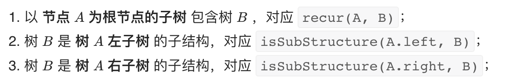

# 小练习


## Day5

#### [剑指 Offer 30. 包含min函数的栈](https://leetcode.cn/problems/bao-han-minhan-shu-de-zhan-lcof/)

定义栈的数据结构，请在该类型中实现一个能够得到栈的最小元素的 min 函数在该栈中，调用 min、push 及 pop 的时间复杂度都是 O(1)。


思路：

利用一个辅助栈，每次入栈的时候，若辅助栈为空则入栈，若辅助栈不为空，则判断入栈的元素是否小于辅助栈顶的元素，若小于则入栈，否则不入栈。

出栈时判断出栈元素与辅助栈的栈顶是否相等，若相等时，则辅助栈也一起出栈。否则辅助栈不出栈。栈顶元素即为栈中的最小值。

```python
class MinStack:

    def __init__(self):
        """
        initialize your data structure here.
        """
        self.A,self.B = [],[]


    def push(self, x: int) -> None:
        self.A.append(x)
        if not self.B or self.B[-1] >= x:
            self.B.append(x);


    def pop(self) -> None:
        if self.A.pop() == self.B[-1]:
            self.B.pop()


    def top(self) -> int:
        return self.A[-1]


    def min(self) -> int:
        return self.B[-1]


# Your MinStack object will be instantiated and called as such:
# obj = MinStack()
# obj.push(x)
# obj.pop()
# param_3 = obj.top()
# param_4 = obj.min()
```

```java
class MinStack {

    /** initialize your data structure here. */
    public MinStack() {
      A = new Stack<>();
      B = new Stack<>():

    }
    
    public void push(int x) {
      A.add(x);
      if(B.isEmpty() || B.peek() >= x){
        B.add(x);
      }

    }
    
    public void pop() {
      if (A.pop().equals(B.peek())){
        B.pop():
      }

    }
    
    public int top() {
      return A.peek();

    }
    
    public int min() {
      return B.peek();

    }
}

/**
 * Your MinStack object will be instantiated and called as such:
 * MinStack obj = new MinStack();
 * obj.push(x);
 * obj.pop();
 * int param_3 = obj.top();
 * int param_4 = obj.min();
 */
```


#### [剑指 Offer 31. 栈的压入、弹出序列](https://leetcode.cn/problems/zhan-de-ya-ru-dan-chu-xu-lie-lcof/)

输入两个整数序列，第一个序列表示栈的压入顺序，请判断第二个序列是否为该栈的弹出顺序。假设压入栈的所有数字均不相等。例如，序列 {1,2,3,4,5} 是某栈的压栈序列，序列 {4,5,3,2,1} 是该压栈序列对应的一个弹出序列，但 {4,3,5,1,2} 就不可能是该压栈序列的弹出序列。

思路：

用一个辅助栈，先按顺序将pushed中的元素入栈，入栈后判断入栈的元素是否与poped的第一个元素相同，若相同则出栈，poped后移一位，知道pushed的元素全部入栈

```python
class Solution:
    def validateStackSequences(self, pushed: List[int], popped: List[int]) -> bool:
        A = []
        j = 0
        for i in pushed:
            A.append(i)
            while A and A[-1] == popped[j]:
                A.pop()
                j += 1
        return len(A) == 0
```

```java
class Solution {
    public boolean validateStackSequences(int[] pushed, int[] popped) {
        Stack<Integer> stack = new Stack<>();
        int i = 0;
        for(int num : pushed){
            stack.push(num);
            while(!stack.isEmpty() && stack.peek() == popped[i]){
                stack.pop();
                i++;
            }
        }
        return stack.isEmpty();

    }
}
```


## Day 6

#### [剑指 Offer 55 - I. 二叉树的深度](https://leetcode.cn/problems/er-cha-shu-de-shen-du-lcof/)

输入一棵二叉树的根节点，求该树的深度。从根节点到叶节点依次经过的节点（含根、叶节点）形成树的一条路径，最长路径的长度为树的深度。

例如：

给定二叉树 [3,9,20,null,null,15,7]

```
    3
   / \
  9  20
    /  \
   15   7
```

返回它的最大深度 3 。


```python
class Solution:
    def maxDepth(self, root: TreeNode) -> int:
        if(not root):
            return 0
        left = self.maxDepth(root.left)
        right = self.maxDepth(root.right)
        return left +1 if left > right else right + 1
```


```java
class Solution {
    public int maxDepth(TreeNode root) {
        if(root == null) return 0;
        List<TreeNode> queue = new LinkedList<>() {{ add(root); }}, tmp;
        int res = 0;
        while(!queue.isEmpty()) {
            tmp = new LinkedList<>();
            for(TreeNode node : queue) {
                if(node.left != null) tmp.add(node.left);
                if(node.right != null) tmp.add(node.right);
            }
            queue = tmp;
            res++;
        }
        return res;
    }
}

```


## Day 7

#### [剑指 Offer 27. 二叉树的镜像](https://leetcode.cn/problems/er-cha-shu-de-jing-xiang-lcof/)

请完成一个函数，输入一个二叉树，该函数输出它的镜像。

例如输入：

         4
       /   \
      2     7
     / \   / \
    1   3 6   9

镜像输出：

         4
       /   \
      7     2
     / \   / \
    9   6 3   1


**方法一：递归**

思路：

从根结点开始，递归的对树进行遍历，并从叶子结点进行翻转得到镜像。，如果当前遍历到的结点的左右子树都被翻转得到镜像，那么只需要交换两棵子树的位置。

```java
/**
 * Definition for a binary tree node.
 * public class TreeNode {
 *     int val;
 *     TreeNode left;
 *     TreeNode right;
 *     TreeNode(int x) { val = x; }
 * }
 */
class Solution {
    public TreeNode mirrorTree(TreeNode root) {

        if(root == null || (root.left == null &&root.right == null)){
            return root;
        }
        TreeNode left = mirrorTree(root.left);
        TreeNode right = mirrorTree(root.right);
        root.left = right;
        root.right = left;

        return root;

    }
}
```

**方法二：辅助栈**

思路：利用栈遍历树的所有节点node，并交换每个node 的左右节点。

```java
class Solution {
  public TreeNode mirrorTree(TreeNode root) {
    stack<TreeNode> stack = new Stack<>() {{ add(root);}}
    while(stack.isEmpty()) {
      TreeNode node = stack.pop();
      if(node.left != null)
        stack.add(node.left);
      if(node.right != null)
        stack.add(node.right);
      TreeNode tmp = node.left;
      node.left = node.right;
      node.right = tmp;
    
      return root;
  }
}
```


#### [剑指 Offer 28. 对称的二叉树](https://leetcode.cn/problems/dui-cheng-de-er-cha-shu-lcof/)

请实现一个函数，用来判断一棵二叉树是不是对称的。如果一棵二叉树和它的镜像一样，那么它是对称的。

例如，二叉树 [1,2,2,3,4,4,3] 是对称的。

```
    1
   / \
  2   2
 / \ / \
3  4 4  3
```

但是下面这个 [1,2,2,null,3,null,3] 则不是镜像对称的:

```
    1
   / \
  2   2
   \   \
   3    3
```


思路：

若两个树互为镜像则满足条件：

- 他们的跟节点的值相同
- 每个树的右子树都与另一个树的左子树镜像对称

根据以上特点，考虑从根结点开始递归，判断每对节点是否对称

```java
class Solution {
    public boolean isSymmetric(TreeNode root) {
        return root == null ? true : recur(root.left, root.right);
    }
    boolean recur(TreeNode L, TreeNode R) {
        if(L == null && R == null) return true;
        if(L == null || R == null || L.val != R.val) return false;
        return recur(L.left, R.right) && recur(L.right, R.left);
    }
}


```


#### [剑指 Offer 26. 树的子结构](https://leetcode.cn/problems/shu-de-zi-jie-gou-lcof/)

输入两棵二叉树A和B，判断B是不是A的子结构。(约定空树不是任意一个树的子结构)

B是A的子结构， 即 A中有出现和B相同的结构和节点值。

例如:
给定的树 A:

```
     3
    / \
   4   5
  / \
 1   2
```

给定的树 B：

```
   4 
  /
 1
```

返回 true，因为 B 与 A 的一个子树拥有相同的结构和节点值。

思路：

若B是A的字结构，则子结构的根节点可能是树A的任意一个节点，所以首先先序遍历树A中的每个节点 a，判断A种以 a 为根节点的子树是否包含树B


`recur(A, B)` 函数：

**终止条件：**

```
当节点 B 为空：说明树 B 已匹配完成（越过叶子节点），因此返回 truetrue ；
当节点 A 为空：说明已经越过树 A 叶子节点，即匹配失败，返回 falsefalse ；
当节点 A 和 B 的值不同：说明匹配失败，返回 falsefalse ；
```

**返回值：**

```
判断 A 和 B 的左子节点是否相等，即 recur(A.left, B.left) ；
判断 A 和 B 的右子节点是否相等，即 recur(A.right, B.right) ；
```

`isSubStructure(A, B)` 函数：

当 树 *A* 为空 **或** 树 *B* 为空 时，直接返回*false* ；




## Day 8

#### [剑指 Offer 32 - I. 从上到下打印二叉树](https://leetcode.cn/problems/cong-shang-dao-xia-da-yin-er-cha-shu-lcof/)

从上到下打印出二叉树的每个节点，同一层的节点按照从左到右的顺序打印。

例如:
给定二叉树: `[3,9,20,null,null,15,7]`,

```
  3
   / \
  9  20
    /  \
   15   7
```

输出

```
[3,9,20,15,7]
```


思路：

从上至下打印二叉树即按层次输出，称为二叉树的广度优先搜索（BFS），通常借助队列的先入先出特性来实现。

流程：

1.特殊处理：当树的根节点为空时，返回空列表

2.初始化：打印结果列表 `res = []`，包含根节点的队列`queue = [root]`

3.BFS循环：当队列`queue`为空时退出

​	1.出队：队首元素出队，记为 `node`

​	2.打印：将`node.val`添加至列表`tmp`的尾部

​	3.添加子节点：若`node`的左右子节点不为空，则将左（右）子节点加入队列

4.返回值：返回打印结果列表 `res`

**时间复杂度 O(N) ：** N 为二叉树的节点数量，即 BFS 需循环 N 次。
**空间复杂度 O(N) ：** 最差情况下，即当树为平衡二叉树时，最多有 N/2 个树节点同时在 queue 中，使用 O(N) 大小的额外空间。

> Python 中使用 collections 中的双端队列 deque() ，其 popleft() 方法可达到 O(1)O(1) 时间复杂度；列表 list 的 pop(0) 方法时间复杂度为 O(N)O(N) 。
>

```python
import collections
class Solution:
    def levelOrder(self, root: TreeNode) -> List[int]:
        if not root:
            return []
        res = []
        queue = collections.deque()
        queue.append(root)
        while queue:
            node = queue.popleft()
            res.append(node.val)
            if node.left:
                queue.append(node.left)
            if node.right:
                queue.append(node.right)
        return res
```

```java
/**
 * Definition for a binary tree node.
 * public class TreeNode {
 *     int val;
 *     TreeNode left;
 *     TreeNode right;
 *     TreeNode(int x) { val = x; }
 * }
 */
class Solution {
    public int[] levelOrder(TreeNode root) {
        if (root == null)
            return new int[0];
        Queue<TreeNode> queue = new LinkedList<>(){{add(root);}};
        ArrayList<Integer> res = new ArrayList<>();

        while(!queue.isEmpty()){
            TreeNode node = queue.poll();
            res.add(node.val);
            if(node.left != null){
                queue.add(node.left);
            }
            if(node.right != null){
                queue.add(node.right);
            }
        }
        
        int[] result = new int[res.size()];

        for(int i = 0; i < res.size(); i++){
            result[i] = res.get(i);
        }
        return result;

    }
}
```


#### [剑指 Offer 32 - II. 从上到下打印二叉树 II](https://leetcode.cn/problems/cong-shang-dao-xia-da-yin-er-cha-shu-ii-lcof/)

从上到下按层打印二叉树，同一层的节点按从左到右的顺序打印，每一层打印到一行。

例如:
给定二叉树: `[3,9,20,null,null,15,7]`,

```
 3
   / \
  9  20
    /  \
   15   7
```

返回其层次遍历结果：

```
[
  [3],
  [9,20],
  [15,7]
]
```

思路：

与上一题基本类似，采用BFS的方法按层打印，这里的每层打印到一行可以将本层全部节点打印到一行，并将下一层全部节点加入队列，以此类推即可分为多行打印。

流程：

1.特殊处理：当树的根节点为空时，返回空列表

2.初始化：打印结果列表 `res = []`，包含根节点的队列`queue = [root]`

3.BFS循环：当队列`queue`为空时退出

​	1.新建一个临时列表 tmp，存储当前层的打印结果

​	2.当前层循环打印：循环次数为当前层节点数（即队列 queue 的长度）

​		1.出队：队首元素出队，记为 `node`

​		2.打印：将`node.val`添加至列表`tmp`的尾部

​		3.添加子节点：若`node`的左右子节点不为空，则将左（右）子节点加入队列

​	3. 将当前层结果 tmp 添加入 res

4.返回值：返回打印结果列表 `res`

**时间复杂度 O(N) ：** N 为二叉树的节点数量，即 BFS 需循环 N 次。
**空间复杂度 O(N) ：** 最差情况下，即当树为平衡二叉树时，最多有 N/2 个树节点同时在 queue 中，使用 O(N) 大小的额外空间。

```java
/**
 * Definition for a binary tree node.
 * public class TreeNode {
 *     int val;
 *     TreeNode left;
 *     TreeNode right;
 *     TreeNode(int x) { val = x; }
 * }
 */
class Solution {
    public List<List<Integer>> levelOrder(TreeNode root) {
        Queue<TreeNode> queue = new LinkedList<>();
        List<List<Integer>> res = new ArrayList<>();
        if(root != null) 
            queue.add(root);
        while(!queue.isEmpty()){
            List<Integer> tmp = new ArrayList<>();
            for(int i = queue.size(); i > 0; i--){
                TreeNode node = queue.poll();
                tmp.add(node.val);
                if(node.left != null) queue.add(node.left);
                if(node.right != null) queue.add(node.right);
            }
            res.add(tmp);
        }
        return res;

    }
}
```


#### [剑指 Offer 32 - III. 从上到下打印二叉树 III](https://leetcode.cn/problems/cong-shang-dao-xia-da-yin-er-cha-shu-iii-lcof/)

- 利用双端队列的两端皆可添加元素的特性，设打印列表（双端队列）tmp 并规定：
  - 奇数层 则添加至 `tmp` **尾部** ，
  - 偶数层 则添加至 `tmp` **头部** 。

算法流程：

1. 特例处理： 当树的根节点为空，则直接返回空列表 [] ；
2. 初始化： 打印结果空列表 res ，包含根节点的双端队列 deque ；
3. BFS 循环： 当 deque 为空时跳出；
   1. 新建列表 tmp ，用于临时存储当前层打印结果；
   2. 当前层打印循环： 循环次数为当前层节点数（即 deque 长度）；
      1. 出队： 队首元素出队，记为 node；
      2. 打印： 若为奇数层，将 node.val 添加至 tmp 尾部；否则，添加至 tmp 头部；
      3. 添加子节点： 若 node 的左（右）子节点不为空，则加入 deque ；
   3. 将当前层结果 tmp 转化为 list 并添加入 res ；
4. 返回值： 返回打印结果列表 res 即可；

> Java 中将链表 LinkedList 作为双端队列使用。

```java
/**
 * Definition for a binary tree node.
 * public class TreeNode {
 *     int val;
 *     TreeNode left;
 *     TreeNode right;
 *     TreeNode(int x) { val = x; }
 * }
 */
class Solution {
    public List<List<Integer>> levelOrder(TreeNode root) {
        Queue<TreeNode> queue = new LinkedList<>();
        List<List<Integer>> res = new ArrayList<>();
        if(root != null) queue.add(root);
        while(!queue.isEmpty()){
            LinkedList<Integer> tmp = new LinkedList<>();
            for(int i  = queue.size(); i > 0;i--){
                TreeNode node = queue.poll();
                //偶数层 队列头部
                if(res.size() % 2 == 0){
                    tmp.addLast(node.val);
                }
                //奇数层
                else {
                    tmp.addFirst(node.val);
                }
                if(node.left != null) {
                    queue.add(node.left);
                }
                if(node.right != null){
                    queue.add(node.right);
                }
            }
            res.add(tmp);
        }
        return res;

    }
}
```


## Day 9

[剑指 Offer 07. 重建二叉树](https://leetcode.cn/problems/zhong-jian-er-cha-shu-lcof/)

输入某二叉树的前序遍历和中序遍历的结果，请构建该二叉树并返回其根节点。

假设输入的前序遍历和中序遍历的结果中都不含重复的数字。

```java
Input: preorder = [3,9,20,15,7], inorder = [9,3,15,20,7]
Output: [3,9,20,null,null,15,7]
```

```java
Input: preorder = [-1], inorder = [-1]
Output: [-1]
```

思路：

前序遍历性质： 节点按照 `[ 根节点 | 左子树 | 右子树 ]` 排序。
中序遍历性质： 节点按照 `[ 左子树 | 根节点 | 右子树 ]` 排序。

因此：

- 前序遍历的首元素为树的根节点的 `node` 值
- 在中序遍历中搜索根节点`node`的索引，可将中序遍历划分为<font color=red>`[ 左子树 | 根节点 | 右子树 ]`</font>
- 根据中序遍历中的左（右）子树的节点数量，可将前序遍历划分为<font color=red>`[ 根节点 | 左子树 | 右子树 ]`</font>


通过以上三个步骤就可以确定三个节点：1.树的根节点 2.左子树的根节点 3.右子树的根节点。

分治算法：

**递推参数：**根节点在先序遍历的索引`root`、子树在中序遍历的左边界`left`、子树在中序遍历的右边界`right`

**终止条件：**当`left > right`，代表已经越过叶节点，此时返回 *null*

**递推工作：**

1. 建立根节点 `node`：节点值为`preorder[root]`
2. 划分左右子树：查找根节点在中序遍历`inorder`中的索引 `i`

> 使用哈希表 `dic` 存储中序遍历的值与索引的映射，查找操作的时间复杂度为 O(1)*O*(1) ；

**构建左右子树：**开启左右子树递归

|        | 根节点索引          | 中序遍历左边界 | 中序遍历右边界 |
| ------ | ------------------- | -------------- | -------------- |
| 左子树 | root + 1            | Left           | i - 1          |
| 右子树 | i - left + root + 1 | i + 1          | Right          |

>  `i - left + root + 1`含义为 `根节点索引 + 左子树长度 + 1`

```python
# Definition for a binary tree node.
# class TreeNode:
#     def __init__(self, x):
#         self.val = x
#         self.left = None
#         self.right = None

class Solution:
    def buildTree(self, preorder: List[int], inorder: List[int]) -> TreeNode:
        def recur(root,left,right):
            if left > right:                                      #递归终止
                return
            node = TreeNode(preorder[root])                       #建立根节点
            i = dic[preorder[root]]                               #划分根节点、左子树、右子树
            node.left = recur(root + 1, left, i - 1)              #开启左子树递归
            node.right = recur(i - left + root + 1, i + 1, right) #开启右子树递归
            return node                                           #回溯返回根节点

        dic, preorder = {}, preorder
        for i in range(len(inorder)):
            dic[inorder[i]] = i
        return recur(0, 0, len(inorder) -1)
```

```java
class Solution {
    private Map<Integer, Integer> indexMap;

    public TreeNode myBuildTree(int[] preorder, int[] inorder, int preorder_left, int preorder_right, int inorder_left, int inorder_right) {
        if (preorder_left > preorder_right) {
            return null;
        }

        // 前序遍历中的第一个节点就是根节点
        int preorder_root = preorder_left;
        // 在中序遍历中定位根节点
        int inorder_root = indexMap.get(preorder[preorder_root]);
        
        // 先把根节点建立出来
        TreeNode root = new TreeNode(preorder[preorder_root]);
        // 得到左子树中的节点数目
        int size_left_subtree = inorder_root - inorder_left;
        // 递归地构造左子树，并连接到根节点
        // 先序遍历中「从 左边界+1 开始的 size_left_subtree」个元素就对应了中序遍历中「从 左边界 开始到 根节点定位-1」的元素
        root.left = myBuildTree(preorder, inorder, preorder_left + 1, preorder_left + size_left_subtree, inorder_left, inorder_root - 1);
        // 递归地构造右子树，并连接到根节点
        // 先序遍历中「从 左边界+1+左子树节点数目 开始到 右边界」的元素就对应了中序遍历中「从 根节点定位+1 到 右边界」的元素
        root.right = myBuildTree(preorder, inorder, preorder_left + size_left_subtree + 1, preorder_right, inorder_root + 1, inorder_right);
        return root;
    }

    public TreeNode buildTree(int[] preorder, int[] inorder) {
        int n = preorder.length;
        // 构造哈希映射，帮助我们快速定位根节点
        indexMap = new HashMap<Integer, Integer>();
        for (int i = 0; i < n; i++) {
            indexMap.put(inorder[i], i);
        }
        return myBuildTree(preorder, inorder, 0, n - 1, 0, n - 1);
    }
}

```

#### [剑指 Offer 33. 二叉搜索树的后序遍历序列](https://leetcode.cn/problems/er-cha-sou-suo-shu-de-hou-xu-bian-li-xu-lie-lcof/)

输入一个整数数组，判断该数组是不是某二叉搜索树的后序遍历结果。如果是则返回 `true`，否则返回 `false`。假设输入的数组的任意两个数字都互不相同。

```
     5
    / \
   2   6
  / \
 1   3
```

```
输入: [1,6,3,2,5]
输出: false
```

```
输入: [1,3,2,6,5]
输出: true
```

思路：

**后序遍历：**`[ 左子树 | 右子树 | 根节点 ]` ，即遍历顺序为 “左、右、根” 。

**二叉搜索树：** 左子树中所有节点的值 < 根节点的值；右子树中所有节点的值 > 根节点的值；其左、右子树也分别为二叉搜索树

方法一：递归分治

根据二叉搜索树的定义，可以通过递归，判断所有子树的 **正确性** （即其后序遍历是否满足二叉搜索树的定义） ，若所有子树都正确，则此序列为二叉搜索树的后序遍历。


```python
class Solution:
    def verifyPostorder(self, postorder: [int]) -> bool:
        def recur(i, j):
            if i >= j: return True
            p = i
            while postorder[p] < postorder[j]: p += 1
            m = p
            while postorder[p] > postorder[j]: p += 1
            return p == j and recur(i, m - 1) and recur(m, j - 1)

        return recur(0, len(postorder) - 1)

```

方法二：辅助栈

后序遍历倒序：`[ 根节点 | 右子树 | 左子树 ] `。类似 先序遍历的镜像 ，即先序遍历为` “根、左、右”` 的顺序，而后序遍历的倒序为 `“根、右、左”` 顺序。


```java
class Solution {
    public boolean verifyPostorder(int[] postorder) {
        Stack<Integer> stack = new Stack<>();
        int root = Integer.MAX_VALUE;
        for(int i = postorder.length - 1; i >= 0; i--) {
            if(postorder[i] > root) return false;
            while(!stack.isEmpty() && stack.peek() > postorder[i])
            	root = stack.pop();
            stack.add(postorder[i]);
        }
        return true;
    }
}

```


## Day 10

#### [剑指 Offer 54. 二叉搜索树的第k大节点](https://leetcode.cn/problems/er-cha-sou-suo-shu-de-di-kda-jie-dian-lcof/)

给定一棵二叉搜索树，请找出其中第 `k` 大的节点的值。

```
输入: root = [3,1,4,null,2], k = 1
   3
  / \
 1   4
  \
   2
输出: 
```

思路：

二叉搜索树的特点是，左子树 < 根节点 < 右子树，利用该特点，可以讲求二叉搜索树中的第K大的节点转换为求中序遍历倒序 的第k个节点

```java
// 打印中序遍历
void dfs(TreeNode root) {
    if(root == null) return;
    dfs(root.left); // 左
    System.out.println(root.val); // 根
    dfs(root.right); // 右
}

// 打印中序遍历倒序
void dfs(TreeNode root) {
    if(root == null) return;
    dfs(root.right); // 右
    System.out.println(root.val); // 根
    dfs(root.left); // 左
}
```


```java
/**
 * Definition for a binary tree node.
 * public class TreeNode {
 *     int val;
 *     TreeNode left;
 *     TreeNode right;
 *     TreeNode(int x) { val = x; }
 * }
 */
class Solution {
    int res,k;
    public int kthLargest(TreeNode root, int k) {
        this.k = k;
        dfs(root);
        return res;
    }
    void dfs(TreeNode root){
        if(root == null)
            return;
        dfs(root.right);
        if(k==0)
            return;
        if(--k == 0)
            res = root.val;
        dfs(root.left);
    }
}
```

或者将节点遍历一边，将每个值加入列表中，将列表排序后倒序，第k大就是列表中第k-1个数

```python
# Definition for a binary tree node.
# class TreeNode:
#     def __init__(self, x):
#         self.val = x
#         self.left = None
#         self.right = None

class Solution:
    def kthLargest(self, root: TreeNode, k: int) -> int:
        res = []
        def preOrder(root):
            if(not root):
                return 0
            res.append(root.val)
            left = preOrder(root.left)
            right = preOrder(root.right)
        preOrder(root)
        res.sort(reverse=True)        
        return res[k-1]
```

#### [剑指 Offer 68 - I. 二叉搜索树的最近公共祖先](https://leetcode.cn/problems/er-cha-sou-suo-shu-de-zui-jin-gong-gong-zu-xian-lcof/)

给定一个二叉搜索树, 找到该树中两个指定节点的最近公共祖先。

百度百科中最近公共祖先的定义为：“对于有根树 T 的两个结点 p、q，最近公共祖先表示为一个结点 x，满足 x 是 p、q 的祖先且 x 的深度尽可能大（一个节点也可以是它自己的祖先）。”

例如，给定如下二叉搜索树:  root = [6,2,8,0,4,7,9,null,null,3,5]


```
输入: root = [6,2,8,0,4,7,9,null,null,3,5], p = 2, q = 8
输出: 6 
解释: 节点 2 和节点 8 的最近公共祖先是 6。

输入: root = [6,2,8,0,4,7,9,null,null,3,5], p = 2, q = 4
输出: 2
解释: 节点 2 和节点 4 的最近公共祖先是 2, 因为根据定义最近公共祖先节点可以为节点本身。
```

利用迭代搜索：

循环搜索： 当节点 root 为空时跳出；
	当 p, q 都在 root 的 右子树 中，则遍历至 root.righ 
	否则，当 p,q 都在 root 的 左子树 中，则遍历至 root.left ；
	否则，说明找到了 最近公共祖先 ，跳出。
返回值： 最近公共祖先 root 。

```java
/**
 * Definition for a binary tree node.
 * public class TreeNode {
 *     int val;
 *     TreeNode left;
 *     TreeNode right;
 *     TreeNode(int x) { val = x; }
 * }
 */
class Solution {
    public TreeNode lowestCommonAncestor(TreeNode root, TreeNode p, TreeNode q) {
        while(root != null){
            //p,q都在右子树中
            if(root.val < p.val && root.val < q.val){ 
                root = root.right; //遍历至右节点
            }
            //p,q都在左子树中
            else if(root.val > p.val&& root.val > q.val){
                root = root.left;
            } 
            else break;
        }
        return root;
        
    }
}
```

## Day 11


## Day12

#### [543. 二叉树的直径](https://leetcode.cn/problems/diameter-of-binary-tree/)

给定一棵二叉树，你需要计算它的直径长度。一棵二叉树的直径长度是任意两个结点路径长度中的最大值。这条路径可能穿过也可能不穿过根结点。

```
          1
         / \
        2   3
       / \     
      4   5    
返回 3, 它的长度是路径 [4,2,1,3] 或者 [5,2,1,3]。
```

俩个叶子结点的路径 = 根节点左右儿子的深度之和。一条路径的长度为该路径经过的节点数减一，所以求直径（即求路径长度的最大值）等效于求路径经过节点数的最大值减一。

```java
/**
 * Definition for a binary tree node.
 * public class TreeNode {
 *     int val;
 *     TreeNode left;
 *     TreeNode right;
 *     TreeNode() {}
 *     TreeNode(int val) { this.val = val; }
 *     TreeNode(int val, TreeNode left, TreeNode right) {
 *         this.val = val;
 *         this.left = left;
 *         this.right = right;
 *     }
 * }
 */
class Solution {
    int maxd = 0;
    public int diameterOfBinaryTree(TreeNode root) {
        depth(root);
        return maxd;
    }

    public int depth(TreeNode node){
        if(node == null) {
            return 0;
        }
        //左儿子为根的子树的深度
        int L = depth(node.left);
        //右儿子为根的子树的深度
        int R = depth(node.right);
        //因为是任意俩个节点，所以需要与之前的值去做比较
        maxd = Math.max(L+R, maxd);
        return Math.max(L,R) + 1;
    }
}
```

## Day13


## Day14

#### [剑指 Offer 53 - I. 在排序数组中查找数字 I](https://leetcode.cn/problems/zai-pai-xu-shu-zu-zhong-cha-zhao-shu-zi-lcof/)

统计一个数字在排序数组中出现的次数。

```
输入: nums = [5,7,7,8,8,10], target = 8
输出: 2
```

思路：

排序数组 nums 中的所有数字 target 形成一个窗口，记窗口的 左 / 右边界 索引分别为left 和 right ，分别对应窗口左边 / 右边的首个元素。


本题要求统计数字 target 的出现次数，可转化为：使用二分法分别找到 左边界 left 和 右边界 right ，易得数字 target 的数量为 right−left−1 。

```java
class Solution {
  public int search(int[] nums, int target){
    //搜索右边界 right
    int i = 0, j = nums.length - 1;
    while(i<=j){
        int mid = (i + j) / 2;
        if(nums[mid] <= target){
            i = mid + 1;
        }else {
            j = mid - 1;
        }
    }
    int right = i;
    System.out.println("right="+right);
    //若无target 则提前返回
    if(j >= 0 && nums[j] != target) return 0;
    //搜索右边界
    i = 0;
    j = nums.length - 1;
    while(i <= j){
        int mid = (i + j) / 2;
        if(nums[mid] < target){
            i = mid + 1;
        }else {
            j = mid - 1;
        }
    }
    int left = j;
    return right - left - 1;
    
}
}
```

为简化代码，可将**二分查找右边界 right的代码** 封装至函数 `helper()` 。


由于数组 nums 中元素都为整数，因此可以分别二分查找 target 和target−1 的右边界，将两结果相减并返回即可。

```java
class Solution {
  public int search(int[] nums, int target){
      return helper(nums,target) - helper(nums, target - 1);
  }
  int helper(int[] nums, int target){
      int i = 0, j = nums.length - 1;
      while(i <= j){
          int mid = (i + j) / 2;
          if(nums[mid] <= target){
              i = mid + 1;
          }else {
              j = mid -1;
          }
      }
      return i;
  }
}
```


#### [剑指 Offer 53 - II. 0～n-1中缺失的数字](https://leetcode.cn/problems/que-shi-de-shu-zi-lcof/)

一个长度为n-1的递增排序数组中的所有数字都是唯一的，并且每个数字都在范围0～n-1之内。在范围0～n-1内的n个数字中有且只有一个数字不在该数组中，请找出这个数字。

```
输入: [0,1,3]
输出: 2

输入: [0,1,2,3,4,5,6,7,9]
输出: 8
```

方法一：遍历数组

当遍历的索引与数组中的数不相等时，当前索引值为这个数字，否则返回索引值+1

```python
class Solution:
    def missingNumber(self, nums: List[int]) -> int:
        if len(nums) == 1:
            if(nums[0] == 0):
                return 1
        for i in range(len(nums)):
            if(i != nums[i]):
                return i
        return i + 1
```

方法二：二分法

根据题意，数组可以按照以下规则划分为两部分。
左子数组： nums[i] = i ；

右子数组： nums[i] != i;

缺失的数字等于 **“右子数组的首位元素”** 对应的索引；因此考虑使用二分法查找 “右子数组的首位元素” 。


```java
class Solution {
    public int missingNumber(int[] nums) {
        int i = 0,j = nums.length - 1;
        while(i <= j){
            int mid = (i + j) / 2;
            if(nums[mid] == mid){
                i = mid + 1;
            }else{
                j = mid - 1;
            }
        }
        return i;

    }
}
```

时间复杂度：$O(logN)$，二分法为对数级别复杂度

空间复杂度：$O(1)$，几个变量使用常数大小的额外空间


## Day 13

#### [剑指 Offer 11. 旋转数组的最小数字](https://leetcode.cn/problems/xuan-zhuan-shu-zu-de-zui-xiao-shu-zi-lcof/)

把一个数组最开始的若干个元素搬到数组的末尾，我们称之为数组的旋转。

给你一个可能存在 **重复** 元素值的数组 numbers ，它原来是一个升序排列的数组，并按上述情形进行了一次旋转。请返回旋转数组的最小元素。例如，数组 [3,4,5,1,2] 为 [1,2,3,4,5] 的一次旋转，该数组的最小值为 1。  

注意，数组 [a[0], a[1], a[2], ..., a[n-1]] 旋转一次 的结果为数组 [a[n-1], a[0], a[1], a[2], ..., a[n-2]] 。

```
输入：numbers = [3,4,5,1,2]
输出：1
```

寻找旋转数组的最小元素即为寻找 **右排序数组** 的首个元素 nums[x]，称 x 为 **旋转点** 。


```java
class Solution {
    public int minArray(int[] numbers) {
        int i = 0,j = numbers.length - 1;
        while( i < j){
            int mid = (i + j) / 2;
            if(numbers[mid] > numbers[j]){
                i = mid + 1;
            }else if(numbers[mid] < numbers[j]){
                j = mid;
            }else{
                j--;
            }
        }
        return numbers[i];
    }
}
```


## Day 14

#### [剑指 Offer 15. 二进制中1的个数](https://leetcode.cn/problems/er-jin-zhi-zhong-1de-ge-shu-lcof/)

编写一个函数，输入是一个无符号整数（以二进制串的形式），返回其二进制表达式中数字位数为 '1' 的个数（也被称为 [汉明重量](http://en.wikipedia.org/wiki/Hamming_weight)).）。

```
输入：n = 11 (控制台输入 00000000000000000000000000001011)
输出：3
解释：输入的二进制串 00000000000000000000000000001011 中，共有三位为 '1'
```

思路：

巧用 n \& (n - 1)*n*&(*n*−1)

**(n−1) 解析：** 二进制数字 n 最右边的 1 变成 0 ，此 1 右边的 0 都变成 1 。
**n \& (n - 1) 解析：** 二进制数字 n 最右边的 1 变成 0 ，其余不变。


```java
public class Solution {
    // you need to treat n as an unsigned value
    public int hammingWeight(int n) {
        int res = 0;
        while(n != 0 ){
            res++;
            n &= n - 1;
        }
        return res;
    }
}
```

```python
class Solution:
    def hammingWeight(self, n: int) -> int:
        return bin(n).count('1')
```


## Day 15

#### [2309. 兼具大小写的最好英文字母](https://leetcode.cn/problems/greatest-english-letter-in-upper-and-lower-case/)

给你一个由英文字母组成的字符串 s ，请你找出并返回 s 中的 最好 英文字母。返回的字母必须为大写形式。如果不存在满足条件的字母，则返回一个空字符串。

最好 英文字母的大写和小写形式必须 都 在 s 中出现。

英文字母 b 比另一个英文字母 a 更好 的前提是：英文字母表中，b 在 a 之 后 出现。

```
输入：s = "lEeTcOdE"
输出："E"
解释：
字母 'E' 是唯一一个大写和小写形式都出现的字母。
```

解析：使用哈希表 ht 保存字符串 s 中出现过的字符。遍历字符串 s，将当前字符 c 加入 哈希表 ht 中。从大到小枚举英文字母，如果一个英文字母的大写形式和小写形式都出现在哈希表 ht 中，那么直接返回该英文字母。如果所有的英文字母都不符合要求，那么直接返回空字符串。


#### [704. 二分查找](https://leetcode.cn/problems/binary-search/)

给定一个 n 个元素有序的（升序）整型数组 nums 和一个目标值 target  ，写一个函数搜索 nums 中的 target，如果目标值存在返回下标，否则返回 -1。

```
输入: nums = [-1,0,3,5,9,12], target = 9
输出: 4
解释: 9 出现在 nums 中并且下标为 4
```


<font color=red>**二分查找框架**</font>

```java
int binarySearch(int[] nums, int target) {
    int left = 0, right = ...;

    while(...) {
        int mid = left + (right - left) / 2;
        if (nums[mid] == target) {
            ...
        } else if (nums[mid] < target) {
            left = ...
        } else if (nums[mid] > target) {
            right = ...
        }
    }
    return ...;
}

```

技巧：**不要出现 else，而是把所有情况用 else if 写清楚，这样可以清楚地展现所有细节**

```java
class Solution {
    public int search(int[] nums, int target) {
        int left = 0;
        int right = nums.length - 1;

        //判断特殊情况
        if(nums[right] < target){
            return -1;
        }
        
        //二分法，不断缩小范围
        while(left <= right){
            int mid = left + (right - left) / 2 ;
            if(nums[mid] == target){
               return mid;
            }else if(nums[mid] < target){
                left = mid + 1;
            }else if(nums[mid] > target) {
                right = mid - 1;
            }
        }
       return -1;

    }
}
```


**⚠️二分法模版**

```java
int binarySearch(int[] nums, int target) {
    int left = 0, right = ...;

    while(...) {
        int mid = left + (right - left) / 2;
        if (nums[mid] == target) {
            ...
        } else if (nums[mid] < target) {
            left = ...
        } else if (nums[mid] > target) {
            right = ...
        }
    }
    return ...;
}
```

-  寻找一个数（基本的二分搜索）

  这个场景是最简单的，肯能也是大家最熟悉的，即搜索一个数，如果存在，返回其索引，否则返回 -1。

  ```java
  int binarySearch(int[] nums, int target) {
      int left = 0; 
      int right = nums.length - 1; // 注意
  
      while(left <= right) {
          int mid = left + (right - left) / 2;
          if(nums[mid] == target)
              return mid; 
          else if (nums[mid] < target)
              left = mid + 1; // 注意
          else if (nums[mid] > target)
              right = mid - 1; // 注意
      }
      return -1;
  }
  ```

- 寻找左侧边界

  ```java
  int left_bound(int[] nums, int target){
  	if(num.length == 0){
      return -1;
    }
    int left = 0;
    int right = num.length;  //注意
    
    while(left < right) {
      int mid = (left + right) / 2;
      if(nums[mid] == target){
        right = mid;
      }else if(nums[mid] < target){
        left = mid +1;
      }else if(nums[mid] > target){
        right = mid;
      }
    }
    // target 比所有数都大
    if (left == nums.length) return -1;
    // 类似之前算法的处理方式
    return nums[left] == target ? left : -1;
  }
  ```
  
  - 为什么 left = mid + 1，right = mid ？和之前的算法不一样？
  
    答：这个很好解释，因为我们的「搜索区间」是 [left, right) 左闭右开，所以当 nums[mid] 被检测之后，下一步的搜索区间应该去掉 mid 分割成两个区间，即 [left, mid) 或 [mid + 1, right)。
  
  - 将`right` 变成 `nums.length - 1`，用两边都闭的「搜索区间」
  
    ```java
    int left_bound(int[] nums, int target) {
        int left = 0, right = nums.length - 1;
        // 搜索区间为 [left, right]
        while (left <= right) {
            int mid = left + (right - left) / 2;
            if (nums[mid] < target) {
                // 搜索区间变为 [mid+1, right]
                left = mid + 1;
            } else if (nums[mid] > target) {
                // 搜索区间变为 [left, mid-1]
                right = mid - 1;
            } else if (nums[mid] == target) {
                // 收缩右侧边界
                right = mid - 1;
            }
        }
        // 检查出界情况
        if (left >= nums.length || nums[left] != target){
              return -1;
        }
        return left;
    }
    
    ```
  
- 寻找右侧边界的二分查找

  - 左闭右开的写法，只有两处和搜索左侧边界不同，已标注：

    ```java
    int right_bound(int[] nums, int target){
      	if(nums.length == 0){
          return -1;
        }
      
      while(left < right){
        int mid = (left + right) / 2;
        if(nums[mid] == target){
          left = mid + 1;
        }else if(nums[mid] < target){
          left = mid + 1;
        }else if(nums[mid] > target){
          right = mid;
        }
      }
      if (left == 0) return -1;
    	return nums[left-1] == target ? (left-1) : -1;
    }
    ```
  
  - 搜索区间为两端都闭的形式
  
    ```java
    int right_bound(int[] nums, int target) {
        int left = 0, right = nums.length - 1;
        while (left <= right) {
            int mid = left + (right - left) / 2;
            if (nums[mid] < target) {
                left = mid + 1;
            } else if (nums[mid] > target) {
                right = mid - 1;
            } else if (nums[mid] == target) {
                // 这里改成收缩左侧边界即可
                left = mid + 1;
            }
        }
        // 这里改为检查 right 越界的情况，见下图
        if (right < 0 || nums[right] != target) {
          return -1;
        }
        return right;
    }
    ```
  
    
  
  
  
  

## Day 16

#### [2315. 统计星号](https://leetcode.cn/problems/count-asterisks/)

给你一个字符串 s ，每 两个 连续竖线 '|' 为 一对 。换言之，第一个和第二个 '|' 为一对，第三个和第四个 '|' 为一对，以此类推。

请你返回 不在 竖线对之间，s 中 '*' 的数目。

注意，每个竖线 '|' 都会 恰好 属于一个对。

```
输入：s = "l|*e*et|c**o|*de|"
输出：2
解释：不在竖线对之间的字符加粗加斜体后，得到字符串："l|*e*et|c**o|*de|" 。
第一和第二条竖线 '|' 之间的字符不计入答案。
同时，第三条和第四条竖线 '|' 之间的字符也不计入答案。
不在竖线对之间总共有 2 个星号，所以我们返回 2 。
```

分析：首先声明变量 isMath 为 false，当遇到竖线的时候取反，只有当再次遇到竖线的时候第二次取反，当 !isMatch == true 时才统计 * 的数量。

```java
class Solution {
    public int countAsterisks(String s) {
        boolean isMatch = false;
        int count = 0;
        for(char c: s.toCharArray()){
            if(c == '|'){
                isMatch = !isMatch;
            }else if(c == '*' && !isMatch){
                count++;
            }
        }
        return count;

    }
}
```


## Day 17

####  [2325. 解密消息](https://leetcode.cn/problems/decode-the-message/)

难度简单55收藏分享切换为英文接收动态反馈

给你字符串 key 和 message ，分别表示一个加密密钥和一段加密消息。解密 message 的步骤如下：

使用 key 中 26 个英文小写字母第一次出现的顺序作为替换表中的字母 顺序 。
将替换表与普通英文字母表对齐，形成对照表。
按照对照表 替换 message 中的每个字母。
空格 ' ' 保持不变。
例如，key = "happy boy"（实际的加密密钥会包含字母表中每个字母 至少一次），据此，可以得到部分对照表（'h' -> 'a'、'a' -> 'b'、'p' -> 'c'、'y' -> 'd'、'b' -> 'e'、'o' -> 'f'）。
返回解密后的消息。


```
输入：key = "the quick brown fox jumps over the lazy dog", message = "vkbs bs t suepuv"
输出："this is a secret"
解释：对照表如上图所示。
提取 "the quick brown fox jumps over the lazy dog" 中每个字母的首次出现可以得到替换表。
```

思路：使用哈希表存储替换表，随后对字符串 key 进行遍历，当遍历到一个不为空格且未在哈希表中出现的字母时，就将当前字母和cur作为键值对加入哈希表中。这里的cur即为替换之后的字母，初始值为 ‘a’，当哈希表中每添加一个键值对后，cur 就会变为下一个字母。然后对 message 进行遍历就可以得到解密后的消息。

```java
class Solution {
    public String decodeMessage(String key, String message) {
        char cur = 'a';
        Map<Character,Character> rules = new HashMap<>();

        for(int i = 0; i < key.length();i++){
            char c = key.charAt(i);
            if(c != ' ' && !rules.containsKey(c)){
                rules.put(c,cur);
                ++cur;
            }
        }

        StringBuilder sb = new StringBuilder();
        for(int i = 0; i < message.length();++i){
            char c = message.charAt(i);
            if(c!=' '){
                c = rules.get(c);
            }
            sb.append(c);
        }

        return sb.toString();

    }

}
```


## Day 18

#### [1798. 你能构造出连续值的最大数目](https://leetcode.cn/problems/maximum-number-of-consecutive-values-you-can-make/)

给你一个长度为 n 的整数数组 coins ，它代表你拥有的 n 个硬币。第 i 个硬币的值为 coins[i] 。如果你从这些硬币中选出一部分硬币，它们的和为 x ，那么称，你可以 构造 出 x 。

请返回从 0 开始（包括 0 ），你最多能 构造 出多少个连续整数。

你可能有多个相同值的硬币。

```
输入：coins = [1,3]
输出：2
解释：你可以得到以下这些值：
- 0：什么都不取 []
- 1：取 [1]
从 0 开始，你可以构造出 2 个连续整数。

输入：coins = [1,1,1,4]
输出：8
解释：你可以得到以下这些值：
- 0：什么都不取 []
- 1：取 [1]
- 2：取 [1,1]
- 3：取 [1,1,1]
- 4：取 [4]
- 5：取 [4,1]
- 6：取 [4,1,1]
- 7：取 [4,1,1,1]
从 0 开始，你可以构造出 8 个连续整数。
```

**有序**是一个强大的性质，如果对数组排序不影响答案的话，可以尝试将数组排序。


```java
class Solution {
    public int getMaximumConsecutive(int[] coins) {
        int m = 0; //一开始必然能构造出 0 
        Arrays.sort(coins);
        
        for(int n : coins) {
            System.out.printf("m: %d, n: %d\n",m,n);
            if(n > m + 1){ //coins已经排序，不存在比 n 小的数
                break;  //无法构造出 m + 1，跳出循环
            }
            m += n; //可以构造出区间[0，m+n]中的所有整数
        }
        return m + 1;

    }
}
```

#### [35. 搜索插入位置](https://leetcode.cn/problems/search-insert-position/)

给定一个排序数组和一个目标值，在数组中找到目标值，并返回其索引。如果目标值不存在于数组中，返回它将会被按顺序插入的位置。

请必须使用时间复杂度为 O(log n) 的算法。

```
输入: nums = [1,3,5,6], target = 5
输出: 2
```

分析：

二分查找，如果`mid == target`，直接返回 `mid`，最后如果没有找到返回`left`即可。


```java
class Solution {
    public int searchInsert(int[] nums, int target) {
        if(nums.length == 0){
            return 0;
        }
        int left = 0;
        int right = nums.length - 1;

        while(left <= right){
            int mid = (left + right) / 2;
            if(nums[mid] == target){
                return mid;
            }else if(nums[mid] < target){
                left = mid + 1;
            }else if(nums[mid]> target){
                right = mid -1;
            }
        }

    return left;
    }
}
```


## Day 19

#### [2331. 计算布尔二叉树的值](https://leetcode.cn/problems/evaluate-boolean-binary-tree/)

给你一棵 完整二叉树 的根，这棵树有以下特征：

叶子节点 要么值为 0 要么值为 1 ，其中 0 表示 False ，1 表示 True 。
非叶子节点 要么值为 2 要么值为 3 ，其中 2 表示逻辑或 OR ，3 表示逻辑与 AND 。
计算 一个节点的值方式如下：

如果节点是个叶子节点，那么节点的 值 为它本身，即 True 或者 False 。
否则，计算 两个孩子的节点值，然后将该节点的运算符对两个孩子值进行 运算 。
返回根节点 root 的布尔运算值。

完整二叉树 是每个节点有 0 个或者 2 个孩子的二叉树。

叶子节点 是没有孩子的节点。


```
输入：root = [2,1,3,null,null,0,1]
输出：true
解释：上图展示了计算过程。
AND 与运算节点的值为 False AND True = False 。
OR 运算节点的值为 True OR False = True 。
根节点的值为 True ，所以我们返回 true 。
```

思路：

如果当前节点为叶子节点，那么节点的值为它本身；否则节点的值为两个孩子的节点值的逻辑运算结果。我们可以使用递归，如果要计算出当前节点 node 的值，，我们需要先计算出两个叶子结点组成的子树值，然后再计算出当前节点组成的子树的值，过程如下：

- 如果当前节点 node 为叶子结点，则直接返回当前节点的值，而题目中的树为完整二叉树，因此树中每个节点有0个或者2个孩子的二叉树，只需要检测该节点是否有左孩子或者右孩子即可。
- 如果当前节点node含有孩子节点，计算出其左右孩子节点的值分别是 lval 和 rval，如果node节点的值为2，则返回 lval | rval，如果节点 node 值为3，则返回 lval & rval。

```java
class Solution {
    public boolean evaluateTree(TreeNode root) {
        if(root.left == null){
            return root.val == 1;
        }
        if(root.val == 2){
            return evaluateTree(root.left) || evaluateTree(root.right);
        }else {
            return evaluateTree(root.left) && evaluateTree(root.right);
        }

    }
}
```

#### [69. x 的平方根 ](https://leetcode.cn/problems/sqrtx/)

给你一个非负整数 x ，计算并返回 x 的 算术平方根 。

由于返回类型是整数，结果只保留 整数部分 ，小数部分将被 舍去 。

注意：不允许使用任何内置指数函数和算符，例如 pow(x, 0.5) 或者 x ** 0.5 。

```
输入：x = 8
输出：2
解释：8 的算术平方根是 2.82842..., 由于返回类型是整数，小数部分将被舍去。
```

##### 二分查找法

由于 x 的平方跟的整数部分满足 $k^2 \leqslant x $的最大的 k 值，因此我们可以对 k 进行二分查找，从而得到答案。

二分查找的下界为 0，上界可以粗略的设定为 x，在二分查找的每一步中，我们只需要比较中间元素 mid 的平方与 x 的大小关系，并通过比较的结果调整上下界的范围，由于所有的运算都是整数运算，不会存在误差，因此在得到最终答案 ans 后也不需要去尝试 ans+1。

```java
class Solution {
    public int mySqrt(int x) {
        int l = 0;
        int r = x;
        int ans = -1;
        while(l <= r){
            int mid = l + (r - l) / 2;
            if((long)mid * mid <= x){
                ans = mid;
                l = mid + 1;
            }else{
                r = mid - 1;
            }
        }
        return ans;
    }
}
```

##### 牛顿迭代法

首先随便猜一个近似值 *x*，然后不断令 *x* 等于 *x* 和 *a*/*x* 的平均数，迭代个六七次后 *x* 的值就已经相当精确了。

> ( 4 + 2/ 4 ) / 2 = 2.25
>
> ( 2.25 + 2/ 2.25 ) / 2 = 1.56944..
>
> ( 1.56944..+ 2/1.56944..) / 2 = 1.42189..
>
> ( 1.42189..+ 2/1.42189..) / 2 = 1.41423..
>

原理：


```java
class Solution {
    int s;
    public int mySqrt(int x) {
        s = x;
        if(x == 0 ){
            return 0;
        }
        return ((int)(sqrts(x)));
    }

    public double sqrts(double x){
        double res = (x + s / x) / 2;
        if(res == x){
            return x;
        }else {
            return sqrts(res);
        }
    }
}
```


## Day 20

#### [1604. 警告一小时内使用相同员工卡大于等于三次的人](https://leetcode.cn/problems/alert-using-same-key-card-three-or-more-times-in-a-one-hour-period/)

力扣公司的员工都使用员工卡来开办公室的门。每当一个员工使用一次他的员工卡，安保系统会记录下员工的名字和使用时间。如果一个员工在一小时时间内使用员工卡的次数大于等于三次，这个系统会自动发布一个 警告 。

给你字符串数组 keyName 和 keyTime ，其中 [keyName[i], keyTime[i]] 对应一个人的名字和他在 某一天 内使用员工卡的时间。

使用时间的格式是 24小时制 ，形如 "HH:MM" ，比方说 "23:51" 和 "09:49" 。

请你返回去重后的收到系统警告的员工名字，将它们按 字典序升序 排序后返回。

请注意 "10:00" - "11:00" 视为一个小时时间范围内，而 "23:51" - "00:10" 不被视为一小时内，因为系统记录的是某一天内的使用情况。

```
输入：keyName = ["daniel","daniel","daniel","luis","luis","luis","luis"], keyTime = ["10:00","10:40","11:00","09:00","11:00","13:00","15:00"]
输出：["daniel"]
解释："daniel" 在一小时内使用了 3 次员工卡（"10:00"，"10:40"，"11:00"）。


输入：keyName = ["alice","alice","alice","bob","bob","bob","bob"], keyTime = ["12:01","12:00","18:00","21:00","21:20","21:30","23:00"]
输出：["bob"]
解释："bob" 在一小时内使用了 3 次员工卡（"21:00"，"21:20"，"21:30"）。
```

由于给定数组是每个员工在统一天内使用员工卡的时间，因此同一个员工使用员工卡的时间顺序一定是按照递增排列的。只要活的每个员工的全部使用员工卡的时间，即可判断哪些员工受到系统警告，即哪些员工在一小时内使用员工卡的次数大于等于三次。

遍历数组 *keyName* 和 *keyTime* ，即可获得每个员工的全部使用员工卡的时间列表。然后使用哈希表记录每个员工使用员工卡的时间列表，将员工卡的时间转成分钟数方便后续的计算。

获得每个员工是的全部使用员工卡的时间列表之后，再对每个员工分别判断是否系统警告。具体步骤：

对于每个员工，从哈希表中获得该员工的全部使用员工卡的时间列表，并将列表排序，然后遍历排序后的列表。如果发现列表中存在三个连续元素中的最大元素与最小元素之差不超过60，即意味着这三次使用员工卡是在一小时之内发生的，该员工受到警告，当确认某个员工受到警告后，就可以停止遍历该员工的声誉的使用员工卡的时间。使用一个列表存储受到系统警告的员工名字。在得到所有受到警告的员工名字之后，对该列表进行排序，然后返回。

```java
class Solution {
    public List<String> alertNames(String[] keyName, String[] keyTime) {
        Map<String, List<Integer>> timeMap = new HashMap<>();
        int n = keyName.length;
        for(int i = 0; i < n; i++){
            String name = keyName[i];
            String time = keyTime[i];
            timeMap.putIfAbsent(name, new ArrayList<Integer>()); //判断键是否存在，不存在则新建一个
            int hour = (time.charAt(0) - '0') * 10 + (time.charAt(1) - '0');
            int minute = (time.charAt(3) - '0') * 10 + (time.charAt(4) - '0');
            timeMap.get(name).add(hour * 60 + minute);
        }

        List<String> res = new ArrayList<>();
        Set<String> keySet = timeMap.keySet();

        System.out.println(keySet);
        
        for(String name : keySet){
            List<Integer> list = timeMap.get(name);
            System.out.println(list);

            Collections.sort(list);
            int size = list.size();
            System.out.println("sieze:"+size);

            for(int i = 2; i < size; i++){
                int time1 = list.get(i - 2);
                int time2 = list.get(i);
                int difference = time2 - time1;
                System.out.println("difference:"+difference);
                if(difference <= 60){
                    res.add(name);
                    break;
                }
            }
        }
        Collections.sort(res);
        return res;

    }
}
```

代码优化：

```java
class Solution {
    public List<String> alertNames(String[] keyName, String[] keyTime) {
        Map<String, List<Integer>> d = new HashMap<>();
        for (int i = 0; i < keyName.length; ++i) {
            String name = keyName[i];
            String time = keyTime[i];
            int t = Integer.parseInt(time.substring(0, 2)) * 60 + Integer.parseInt(time.substring(3));
            d.computeIfAbsent(name, k -> new ArrayList<>()).add(t);
        }
        List<String> ans = new ArrayList<>();
        for (var e : d.entrySet()) {
            var ts = e.getValue();
            int n = ts.size();
            if (n > 2) {
                Collections.sort(ts);
                for (int i = 0; i < n - 2; ++i) {
                    if (ts.get(i + 2) - ts.get(i) <= 60) {
                        ans.add(e.getKey());
                        break;
                    }
                }
            }
        }
        Collections.sort(ans);
        return ans;
    }
}

```


#### [367. 有效的完全平方数](https://leetcode.cn/problems/valid-perfect-square/)

给你一个正整数 num 。如果 num 是一个完全平方数，则返回 true ，否则返回 false 。

完全平方数 是一个可以写成某个整数的平方的整数。换句话说，它可以写成某个整数和自身的乘积。

不能使用任何内置的库函数，如  sqrt 。

- 暴力：

  如果 num 为完全平方数，那么一定存在正整数 x 满足 x*x = num，从 1 开始，从小到大遍历所有正整数，寻找是否存在满足条件的正整数x，如果出现 $x \times  x = num$，则停止遍历，不存在满足条件的x。

  ```java
  class Solution {
      public boolean isPerfectSquare(int num) {
          long x = 1;
          long square = 1;
          while(square <= num){
              if(square == num){
                  return true;
              }
              ++x;
              square = x * x;
          }
          return false;
  
      }
  }
  ```

- 二分法：

  使用二分查找来优化暴力方法中的搜索过程。因为 num 是正整数，所以若正整数 x 满足，$x \times x=num$，则 x 一定满足 $1 \leqslant x \leqslant num$，所以可以将 1 和 num 作为分发查找搜索区间的初始边界。

  <font color=red>**注意：**</font>

  在移动左侧便捷 left 和右侧边界 right 时，新的搜索区间都不会包含被检查的下标 mid，所以搜索区间的边界始终是我们没有检查过的，因此当 *left == right*是，仍然需要检查*mid = (left + right)/2*

  ```java
  class Solution {
      public boolean isPerfectSquare(int num) {
          int left = 0;
          int right = num;
          while(left <= right){
              int mid = (right - left) / 2 + left;
              long squre = (long) mid * mid;
              if(squre < num){
                  left = mid + 1;
              }else if(squre > num){
                  right = mid - 1;
              }else{
                  return true;
              }
          }
          return false;
  
      }
  }
  ```


## Day 21

#### [1233. 删除子文件夹](https://leetcode.cn/problems/remove-sub-folders-from-the-filesystem/)

你是一位系统管理员，手里有一份文件夹列表 folder，你的任务是要删除该列表中的所有 子文件夹，并以 任意顺序 返回剩下的文件夹。

如果文件夹 folder[i] 位于另一个文件夹 folder[j] 下，那么 folder[i] 就是 folder[j] 的 子文件夹 。

文件夹的「路径」是由一个或多个按以下格式串联形成的字符串：'/' 后跟一个或者多个小写英文字母。

例如，"/leetcode" 和 "/leetcode/problems" 都是有效的路径，而空字符串和 "/" 不是。

```
输入：folder = ["/a","/a/b","/c/d","/c/d/e","/c/f"]
输出：["/a","/c/d","/c/f"]
解释："/a/b" 是 "/a" 的子文件夹，而 "/c/d/e" 是 "/c/d" 的子文件夹。
```

- **排序**

  将字符串数组 *folder* 按照字典顺序进行排序，在排序完成后，对于每一个*folder[i]* ，如果*folder[i-1]*恰好是它的前缀，并且*folder[i]* 第一个多处的字符是 /，那么我们就可以把*folder[i]*删除。

  当 folder[i] 被删除后，后续的所有字符串都需要向前移动一个位置。

  ```java
  class Solution {
      public List<String> removeSubfolders(String[] folder) {
          Arrays.sort(folder);
          List<String> ans = new ArrayList<String>();
          ans.add(folder[0]);
          for (int i = 1; i < folder.length; ++i) {
              int pre = ans.get(ans.size() - 1).length();
              if (!(pre < folder[i].length() && ans.get(ans.size() - 1).equals(folder[i].substring(0, pre)) && folder[i].charAt(pre) == '/')) {
                  ans.add(folder[i]);
              }
          }
          return ans;
      }
  }
  ```

  

- **字典树**

  使用字典树来解决这个问题，文件夹的拓扑结构正好是树形结构，即字典树上的每一个节点就是一个文件夹。

  对于字典树中的每一个节点，我们仅需要存储一个变量 ref，如果 $ref \geq 0 $，那么该节点对应着$folder[ref]$，否则（ref = -1）说明该节点只是一个中间节点。

  首先将一个文件夹按照“/”进行分割，作为一条路径加入字典树中。随后我们对字典树进行一次深度优先搜索，搜索的过程中，如果我们走到了一个$ref \geq 0$的节点，就将其加入答案，并且可以直接回溯，因为后续的所有节点都是该节点的子文件夹。

  ```java
  class Solution {
      public List<String> removeSubfolders(String[] folder) {
          Trie root = new Trie();
          for (int i = 0; i < folder.length; ++i) {
              List<String> path = split(folder[i]);
              Trie cur = root;
              for (String name : path) {
                  cur.children.putIfAbsent(name, new Trie());
                  cur = cur.children.get(name);
              }
              cur.ref = i;
          }
  
          List<String> ans = new ArrayList<String>();
          dfs(folder, ans, root);
          return ans;
      }
  
      public List<String> split(String s) {
          List<String> ret = new ArrayList<String>();
          StringBuilder cur = new StringBuilder();
          for (int i = 0; i < s.length(); ++i) {
              char ch = s.charAt(i);
              if (ch == '/') {
                  ret.add(cur.toString());
                  cur.setLength(0);
              } else {
                  cur.append(ch);
              }
          }
          ret.add(cur.toString());
          return ret;
      }
  
      public void dfs(String[] folder, List<String> ans, Trie cur) {
          if (cur.ref != -1) {
              ans.add(folder[cur.ref]);
              return;
          }
          for (Trie child : cur.children.values()) {
              dfs(folder, ans, child);
          }
      }
  }
  
  class Trie {
      int ref;
      Map<String, Trie> children;
  
      public Trie() {
          ref = -1;
          children = new HashMap<String, Trie>();
      }
  }
  ```


## Day 22

#### [1797. 设计一个验证系统](https://leetcode.cn/problems/design-authentication-manager/)

你需要设计一个包含验证码的验证系统。每一次验证中，用户会收到一个新的验证码，这个验证码在 currentTime 时刻之后 timeToLive 秒过期。如果验证码被更新了，那么它会在 currentTime （可能与之前的 currentTime 不同）时刻延长 timeToLive 秒。

请你实现 AuthenticationManager 类：

AuthenticationManager(int timeToLive) 构造 AuthenticationManager 并设置 timeToLive 参数。
generate(string tokenId, int currentTime) 给定 tokenId ，在当前时间 currentTime 生成一个新的验证码。
renew(string tokenId, int currentTime) 将给定 tokenId 且 未过期 的验证码在 currentTime 时刻更新。如果给定 tokenId 对应的验证码不存在或已过期，请你忽略该操作，不会有任何更新操作发生。
countUnexpiredTokens(int currentTime) 请返回在给定 currentTime 时刻，未过期 的验证码数目。
如果一个验证码在时刻 t 过期，且另一个操作恰好在时刻 t 发生（renew 或者 countUnexpiredTokens 操作），过期事件 优先于 其他操作。


```java
class AuthenticationManager {

    private int timeToLive;
    // 存储id的最后一次更新的时间
    private final HashMap<String, Integer> map = new HashMap<>();
    // 使用两个列表分别储存所有记录的id和time
    List<String> idList = new ArrayList<>();
    List<Integer> timeList = new ArrayList<>();
    // 表示上一次查询未过时验证码时，第一个未过时的验证码在列表中的索引
    int start = 0;

    public AuthenticationManager(int timeToLive) {
        this.timeToLive = timeToLive;
    }

    public void generate(String tokenId, int currentTime) {
        map.put(tokenId, currentTime);
        idList.add(tokenId);
        timeList.add(currentTime);
    }

    public void renew(String tokenId, int currentTime) {
        if (map.containsKey(tokenId)) {
            // 若该id存在且未过时，则更新map并给列表添加记录
            if (map.get(tokenId) > currentTime - timeToLive) {
                map.put(tokenId, currentTime);
                idList.add(tokenId);
                timeList.add(currentTime);
            }
        }
    }

    public int countUnexpiredTokens(int currentTime) {
        int n = idList.size();
        int i = start;
        for (; i < n; i++) {
            String id = idList.get(i);
            Integer time = timeList.get(i);
            // 遇到没超时的记录就停止遍历
            if (time > currentTime - timeToLive) break;
            // 如果这一id的最后一次更新时间和该次记录的时间相同，则说明这一id已经过时
            if (map.get(id).equals(time)) {
                map.remove(id);
            }
        }
        // 因为下一次时间肯定不早于这次的时间，所以下一次查询从start开始即可
        start = i;
        return map.size();
    }
}

```


## Day 23

#### [1223. 掷骰子模拟](https://leetcode.cn/problems/dice-roll-simulation/)

有一个骰子模拟器会每次投掷的时候生成一个 1 到 6 的随机数。

不过我们在使用它时有个约束，就是使得投掷骰子时，连续 掷出数字 i 的次数不能超过 rollMax[i]（i 从 1 开始编号）。

现在，给你一个整数数组 rollMax 和一个整数 n，请你来计算掷 n 次骰子可得到的不同点数序列的数量。

假如两个序列中至少存在一个元素不同，就认为这两个序列是不同的。由于答案可能很大，所以请返回 模 10^9 + 7 之后的结果。

```
输入：n = 2, rollMax = [1,1,2,2,2,3]
输出：34
解释：我们掷 2 次骰子，如果没有约束的话，共有 6 * 6 = 36 种可能的组合。但是根据 rollMax 数组，数字 1 和 2 最多连续出现一次，所以不会出现序列 (1,1) 和 (2,2)。因此，最终答案是 36-2 = 34。
```


思路（动态规划）：

我们重新定义骰子模拟器每次投掷生成的随机数为 0∼5，且连续掷出数字 *i* 的次数不能超过 *rollMax[i]*，$ 0\leq i \geq 5$。

定义状态`d[i][j][k]`表示意见完成了 i 次骰子，第 i 次掷的是 j，并且已经连续掷了 k 次 j 的合法序列数。

初始状态从 `i=1`开始，对于所有的$i \in [0,5]$，令`d[1][j][1]=1`.

状态转移时，首先枚举表示上一次投掷的状态`d[i-1][j][k]`，然后再枚举当前这一次投掷生成的随机数 **p**，根据 **p** 是否等于 **j** 来区分情况。

- 若$p \neq j$，则令 $d[i][p][1] + d[i-1][j][k]$
- 若$p = j$，且 $k+1 \leq rollMax[j]$，则令$d[i][p][k+1] + d[i-1][j][k]$


所以最终的答案是$\sum_{j=0}^{5} \sum_{k=1}^{rollMax[j] d[n][j][k]}$


```java
class Solution {
    public int dieSimulator(int n, int[] rollMax) {
        long mod=(long)(1e9+7);
        long[][] dp =new long[6][16];
        long[][] pre =new long[6][16];
        long[][] change;
        //对于第一个骰子
        for(int j=0;j<6;j++){
            pre[j][0]=5;//不是j点数
            pre[j][1]=1;//j点数连续一次
        }
        for(int i=1;i<n;i++){
            //对于第n=i+1个骰子，从这个骰子是否为j的视角看，连续个数为k等于n-1的连续个数为k-1（k>0时）
            for(int j=0;j<6;j++){
                long sum=0;
                for(int k=rollMax[j];k>0;k--){//对于没有超出次数的情况，最优就是连续投
                    long tmp=pre[j][k-1];
                    dp[j][k]=tmp;//连续投次数不变
                    sum+=tmp;
                }
                //对于此次不投j的情况，要考虑之前0到rollMax[j]连续情况，但是要从之前也不投j的情况中，减去不满足其他5种规则的情况
                dp[j][0]=(pre[j][rollMax[j]]+sum)*5; //因为此次不投j所以还有5种情况，要乘以五
                for(int z=0;z<6;z++){
                    if(z!=j) dp[j][0]-=pre[z][rollMax[z]];
                }
                dp[j][0]%=mod;
            }
            change=pre;
            pre=dp;
            dp=change;
        }

        long ret=0;
        //最后的结果是对于n个骰子，考虑6种禁手，最后一个骰子的所有情况和
        for(int j=0;j<16;++j){
            ret+=pre[0][j];
            ret%=mod;
        }
         return (int)ret;
    }
}
```


## Day 24

#### [2335. 装满杯子需要的最短总时长](https://leetcode.cn/problems/minimum-amount-of-time-to-fill-cups/)

现有一台饮水机，可以制备冷水、温水和热水。每秒钟，可以装满 2 杯 不同 类型的水或者 1 杯任意类型的水。

给你一个下标从 0 开始、长度为 3 的整数数组 amount ，其中 amount[0]、amount[1] 和 amount[2] 分别表示需要装满冷水、温水和热水的杯子数量。返回装满所有杯子所需的 最少 秒数。

```
输入：amount = [1,4,2]
输出：4
解释：下面给出一种方案：
第 1 秒：装满一杯冷水和一杯温水。
第 2 秒：装满一杯温水和一杯热水。
第 3 秒：装满一杯温水和一杯热水。
第 4 秒：装满一杯温水。
可以证明最少需要 4 秒才能装满所有杯子。
```

思路：

（贪心算法）

假设不同类型杯子的数量分别为 *x*, *y* 和 *z*，其中 *x*≤*y*≤*z*

- 如果 *x*+*y*≤*z*，那么每次装满 *z* 的时候，可以同时装满 *x* 或 *y*，因此总时长为 *z*。
- 如果 *x+y>z*，令 *t=x+y-z*，所以 *t*=*x*+*y*−*z*≤*x*≤*y*
  - 如果 t 为 偶数，相应的`x+y+z`也为偶数，那么可以同时将 x 和 y 都装满 $t/2$，剩余的 x + y - t = z，可以同时装满，因此总时长为`t/2 + z = x+y-z/2 + z=x+y+z/2`
  - 如果 t 为奇数，相应的`x+y+z`也为奇数，那么可以同时将 x 和 y 都装满 $t-1/2$，剩余的 *x*+*y*−(*t*−1)=*z*+1>*z*，因此总时长为`t-1/2 + z + 1 = x+y-z-1/2 + z + 1 = x+y+z+1/2`

```java
class Solution {
    public int fillCups(int[] amount) {
        Arrays.sort(amount);
        if (amount[2] > amount[1] + amount[0]) {
            return amount[2];
        }
        return (amount[0] + amount[1] + amount[2] + 1) / 2;
    }
}
```


## Day 25

#### [1234. 替换子串得到平衡字符串](https://leetcode.cn/problems/replace-the-substring-for-balanced-string/)

有一个只含有 'Q', 'W', 'E', 'R' 四种字符，且长度为 n 的字符串。

假如在该字符串中，这四个字符都恰好出现 n/4 次，那么它就是一个「平衡字符串」。 

给你一个这样的字符串 s，请通过「替换一个子串」的方式，使原字符串 s 变成一个「平衡字符串」。

你可以用和「待替换子串」长度相同的 任何 其他字符串来完成替换。

请返回待替换子串的最小可能长度。

如果原字符串自身就是一个平衡字符串，则返回 0。

```
输入：s = "QWER"
输出：0
解释：s 已经是平衡的了。
```


思路：滑动窗口

设 partial= n/4，我们选择 s  的一个子串作为待替换子串，只有当 s 剩余的部分中“Q’，"w’，"E，R’的出现次数都小于等于 partial时，我们才有可能使 s 变为 [平衡字符串J。

如果原始的 s 就是 平衡字符串，我们直接返回 0，否则我们按照以下思路求解。

从小到大枚举待替换子串的左端点 $l$，为了使得替换的长度最小，我们要找到最近的右端点 r，使得去除$(l,r)$之后的剩余部分满足上述条件。不难发现，随着$l$的递增，$r$也是递增的。

具体的，我们使用滑动窗口来维护区间$(l,r)$之外的剩余部分中“Q’，“W’，"E，R”的出现次数，当其中一种字符的出现次数大于 partial时，令 s[r] 的出现次数减 1，并使得 r 向右移动一个单位。该操作一直被执行，直到条件被满足或者 r 到达 s 的末尾。

如果找到了使得条件被满足的 r，我们用r -1 来更新答案，然后令$s[l]$ 的出现次数加 1，并使得 1 向右移动个单位进行下一次枚举。否则，后序的$l$也将不会有合法的 r，此时我们可以直接跳出循环。对于所有合法的$[l,r)$，取 r-1 的最小值做为答案。

```java
class Solution {
    public int balancedString(String s) {
        int[] cnt = new int['Z'];
        for (int i = 0; i < s.length(); i++) {
            char c = s.charAt(i);
            cnt[c]++;
        }

        int partial = s.length() / 4;
        if (cnt['Q'] == partial && cnt['W'] == partial && cnt['E'] == partial && cnt['R'] == partial){
            return 0; // 已经符合
        }
        int res = s.length();
        int left = 0;
        //枚举子串右端点
        for (int right = 0; right < s.length(); right++) {
            --cnt[s.charAt(right)];
            while(cnt['Q'] <= partial && cnt['W'] <= partial && cnt['E'] <= partial && cnt['R'] <= partial){
                res = Math.min(res, right - left + 1);
                ++cnt[s.charAt(left++)];
            }
            
        }
        return res;
    }
}
```


## Day 26

#### [剑指 Offer 35. 复杂链表的复制](https://leetcode.cn/problems/fu-za-lian-biao-de-fu-zhi-lcof/)

请实现 copyRandomList 函数，复制一个复杂链表。在复杂链表中，每个节点除了有一个 next 指针指向下一个节点，还有一个 random 指针指向链表中的任意节点或者 null。


给定链表的头节点 head ，复制普通链表很简单，只需遍历链表，每轮建立新节点 + 构建前驱节点 pre 和当前节点 node 的引用指向即可。

本题链表的节点新增了 random 指针，指向链表中的 任意节点 或者 null 。这个 random 指针意味着在复制过程中，除了构建前驱节点和当前节点的引用指向 pre.next ，还要构建前驱节点和其随机节点的引用指向 pre.random 。

本题难点： 在复制链表的过程中构建新链表各节点的 random 引用指向。

思路：**哈希表**

利用哈希表的查询特点，考虑构建原链表节点和新链表对应节点的健值对映射关系，再遍历构建新链表各节点的next和random引用指向即可。

算法流程：

1. 若头节点head为空，直接返回null
2. 初始化：哈希表dic，节点cur指向头节点
3. 复制链表：
   1. 建立新节点，并向dic添加键值对（原cur节点，新cur节点）
   2. cur遍历至原链表下一节点
4. 构建新链表的引用指向
   1. 构建新节点的next和random引用指向
   2. cur遍历至原链表下一节点
5. 返回值：新链表的头节点dic[cur]

```java
/*
// Definition for a Node.
class Node {
    int val;
    Node next;
    Node random;

    public Node(int val) {
        this.val = val;
        this.next = null;
        this.random = null;
    }
}
*/
class Solution {
    public Node copyRandomList(Node head) {
        if(head == null){
            return null;
        }
        Node cur  = head;
        Map<Node,Node> map = new HashMap<>();

        //复制各节点，并建立原节点->新节点的map映射
        while(cur != null){
            map.put(cur,new Node(cur.val));
            cur = cur.next;
        }
        cur = head;

        //构建新链表的next 和 random 指向
        while(cur != null){
            map.get(cur).next = map.get(cur.next);
            map.get(cur).random = map.get(cur.random);
            cur = cur.next;
        }

        //返回新链表的头节点
        return map.get(head); 
        
    }
}
```


